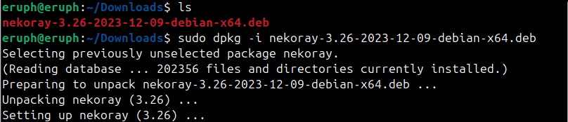
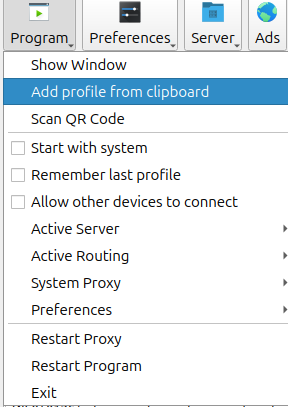
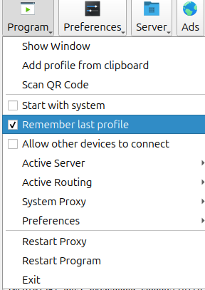
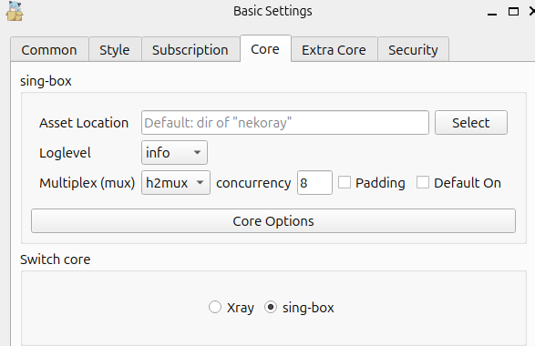
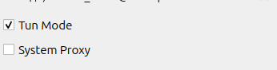

# Инструкция по установке и настройке Linux(Debian)

# Nekoray

## 1. Установите последний релиз для своей ОС(в нашем случае это пакет .deb)

## [Скачать](https://github.com/Mahdi-zarei/nekoray/releases)

## 2. Перейти с помощью команды cd в папку Downloads

## Команда для ввода: sudo dpkg -i "path-to-deb-file"

## 3. В списке приложений появится nekoray. Копируем ключ-ссылку из бота и вставляем.

## 4. Запоминаем последний добавленный профиль.

## 5. Выбираем core sing-box.

## 6. Включаем Tun Mode и запускаем профиль.

